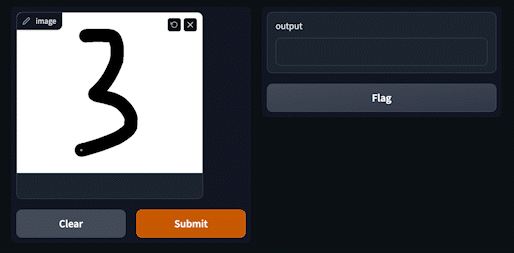

# aws-digit-recognition
Cloud-based Image Recognition AI on AWS

  

This is a straightforward web application that leverages a machine learning model to recognize handwritten digits. The user is prompted to draw a number between 0 and 9. The application then captures the drawn image and sends an HTTP request to an AWS Lambda function. This function queries a containerized machine learning model that was previously trained on a dataset of handwritten digits. Once the model makes its prediction, it sends the result back to the user. The figure below illustrates the end-to-end pipeline:

  

The Lambda function utilized by the application is powered by a convolutional neural network that was trained specifically for the task of recognizing handwritten digits. To train the model, an isolated deep learning Amazon Machine Image (AMI) was employed to ensure a consistent and stable training environment. Following training, the model was containerized and uploaded to an AWS Elastic Container Registry for easy accessibility and scalability.

  

# What I've Learned
* How to use AWS products such as AWS Cloud9, AWS Lambda, and AWS Elastic Container Registry.
* How to train an machine learning model using a deep learning AMI.
* How to deploy a pretrained model using Docker + AWS Lambda.
* How to set up an API gateway to query an AWS Lambda function.
* How to set create a basic app interface with [Gradio](https://gradio.app/).
